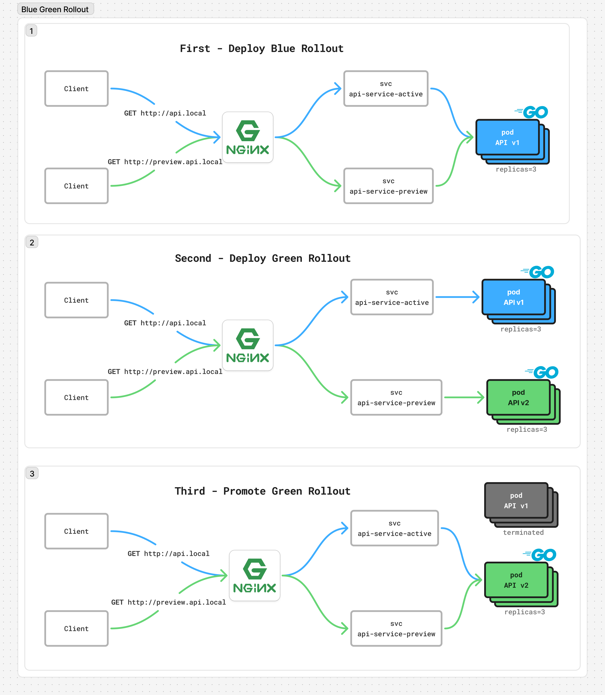
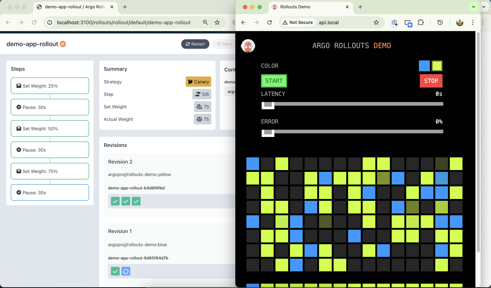

# 🚀 Argo Rollouts Blue-Green & Canary Demo

> **Zero-downtime deployments made simple!** A hands-on demonstration of advanced Kubernetes deployment strategies using Argo Rollouts.

[](https://kubernetes.io/)
[](https://argoproj.github.io/)

## 🎯 What You'll Learn

This repository provides **production-ready examples** of:
- 🔵🟢 **Blue-Green Deployments** - Instant traffic switching with zero downtime
- 🐦 **Canary Deployments** - Gradual rollout with traffic splitting  
- 🏗️ **Production-grade deployment strategies**






## 📁 Project Structure

```
📦 argo-rollout-bluegreen-canary-demo
├── 🔵 blue-green-rollout/      # 🏭 Production-ready with NGINX Ingress
│   ├── blue-green-rollout.yaml            # Main rollout configuration
│   ├── api-ingress.yaml                   # Ingress routing rules
│   └── src/                               # 📸 Screenshots & diagrams
└── 🐦 canary-rollout/                     # 📈 Progressive deployment
    ├── canary-rollout.yaml                # Canary configuration
    └── src/                               # 📊 Dashboard screenshots
```

## 🚀 Quick Start

### 📋 Prerequisites
- ☸️ **Kubernetes cluster** (Docker Desktop recommended for local development)
- 🔧 **kubectl** configured and working
- 🏃‍♂️ **Ready to deploy!**

### ⚡ One-Command Setup
```bash
# 🎯 Install Argo Rollouts (copy & paste this!)
kubectl create namespace argo-rollouts && \
kubectl apply -n argo-rollouts -f https://github.com/argoproj/argo-rollouts/releases/latest/download/install.yaml

# ✅ Verify installation
kubectl get pods -n argo-rollouts

# 🛠️ Install kubectl plugin for better UX (optional but recommended!)
brew install argoproj/tap/kubectl-argo-rollouts
```

> 💡 **Pro Tip**: The kubectl plugin gives you a beautiful dashboard and easier rollout management!

## 🎮 Choose Your Adventure

### � **Option 1: Blue-Green Deployment** - Production-Ready with NGINX Ingress
*Real-world setup with domain names and zero downtime*

```bash
cd blue-green-rollout/
kubectl apply -f blue-green-rollout.yaml
kubectl apply -f api-ingress.yaml

# 🌍 Test with real domains (add to /etc/hosts if needed)
curl http://api.local          # Production traffic
curl http://preview.api.local  # Preview your new version
```

**What makes it production-ready:**
- 🌐 Stable domain names
- 🔄 No connection disruption during promotion  
- 👀 Always accessible active and preview versions
- 🚀 Mimics real load balancer behavior
- ⚡ Instant traffic switching between versions

---

### 🐦 **Option 2: Canary Deployment** - Progressive Traffic Splitting
*Gradual rollout with fine-grained control*

```bash
cd canary-rollout/
kubectl apply -f canary-rollout.yaml

# 📊 Watch the magic happen
kubectl argo rollouts get rollout api-rollout --watch
```

**Traffic progression:**
- 🟢 **Step 1**: 25% new version, 75% old version
- 🟡 **Step 2**: 50% new version, 50% old version  
- 🟠 **Step 3**: 75% new version, 25% old version
- 🔵 **Step 4**: 100% new version (promotion complete)

## 🎯 What You'll Master

| Feature | Blue-Green | Canary | Description |
|---------|------------|--------|-------------|
| 🚀 **Zero Downtime** | ✅ | ✅ | Users never experience service interruption |
| 🎛️ **Manual Control** | ✅ | ✅ | You decide when to promote or rollback |
| 📊 **Traffic Splitting** | ❌ | ✅ | Gradual user migration between versions |
| ⚡ **Instant Switching** | ✅ | ❌ | Immediate traffic redirection |
| 🔄 **Easy Rollback** | ✅ | ✅ | One command to revert to previous version |
| 🏭 **Production Ready** | ✅ | ✅ | Battle-tested deployment strategies |

## 🛠️ Useful Commands

```bash
# 📊 Watch rollout progress in real-time
kubectl argo rollouts get rollout api-rollout --watch

# 🎯 Promote to next step (canary) or full promotion (blue-green)
kubectl argo rollouts promote api-rollout

# 🔄 Abort and rollback immediately
kubectl argo rollouts abort api-rollout

# 📈 Open the Argo Rollouts dashboard
kubectl argo rollouts dashboard

# 🔍 Get rollout status and history
kubectl argo rollouts status api-rollout
kubectl argo rollouts history api-rollout
```

## 🎓 Learning Path

1. **Start with Blue-Green** 🔵🟢 → Experience instant traffic switching with NGINX Ingress
2. **Master Canary** 🐦 → Experiment with progressive traffic splitting
3. **Compare Strategies** ⚖️ → Understand when to use each approach
4. **Read the Docs** 📚 → Check each subdirectory's README for deep dives

## 🚨 Troubleshooting

<details>
<summary><strong>Common Issues & Solutions</strong></summary>

### 🔧 Rollout stuck in "Progressing" state
```bash
# Check pod status
kubectl get pods -l app=api-app
kubectl describe rollout api-rollout
```

### 🌐 Can't access api.local
```bash
# Add to /etc/hosts (macOS/Linux)
echo "127.0.0.1 api.local preview.api.local" | sudo tee -a /etc/hosts
```

### 📊 Dashboard not accessible
```bash
# Make sure you have the plugin installed
kubectl argo rollouts version
# Then start dashboard
kubectl argo rollouts dashboard
```

</details>
