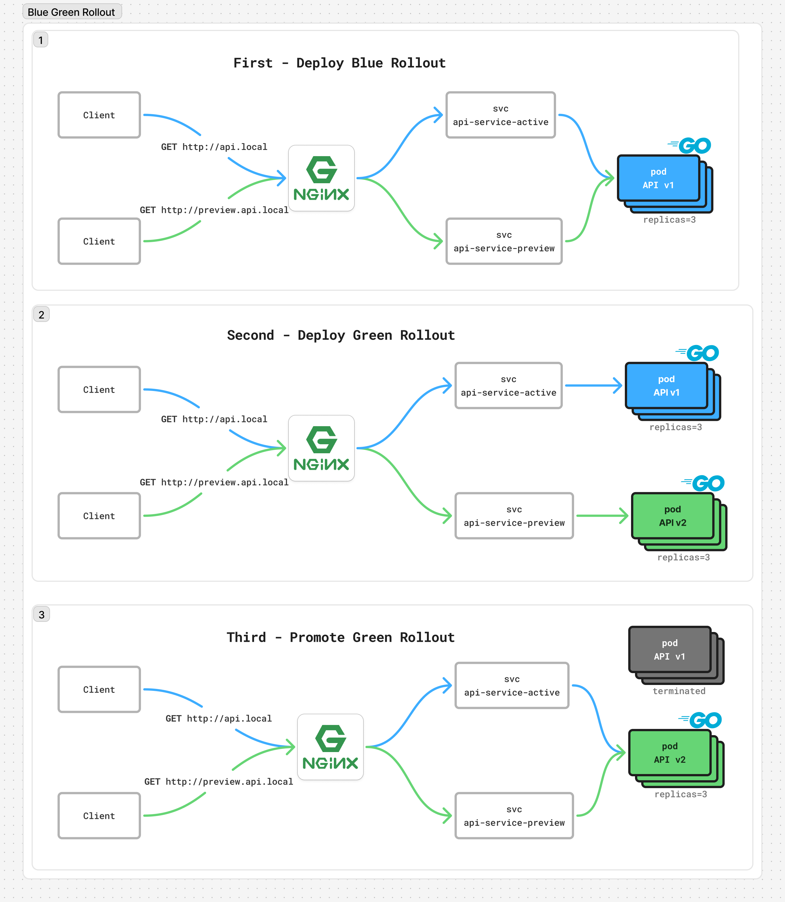
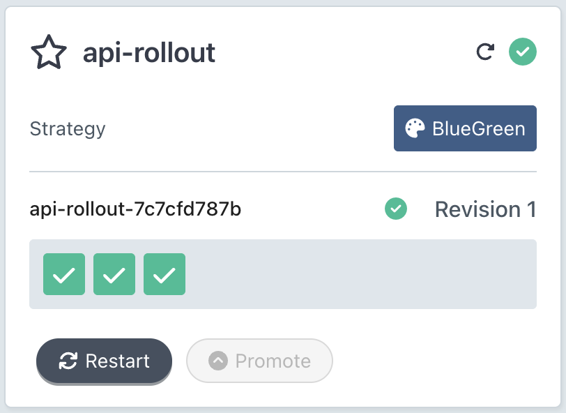
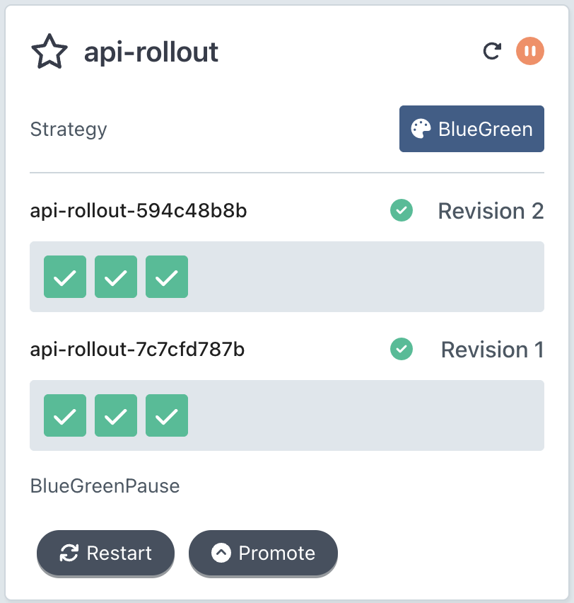
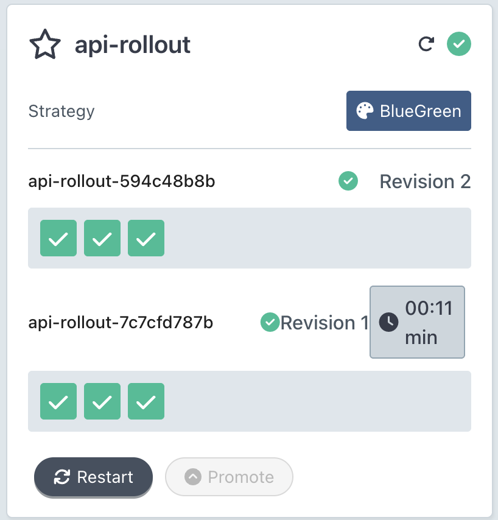
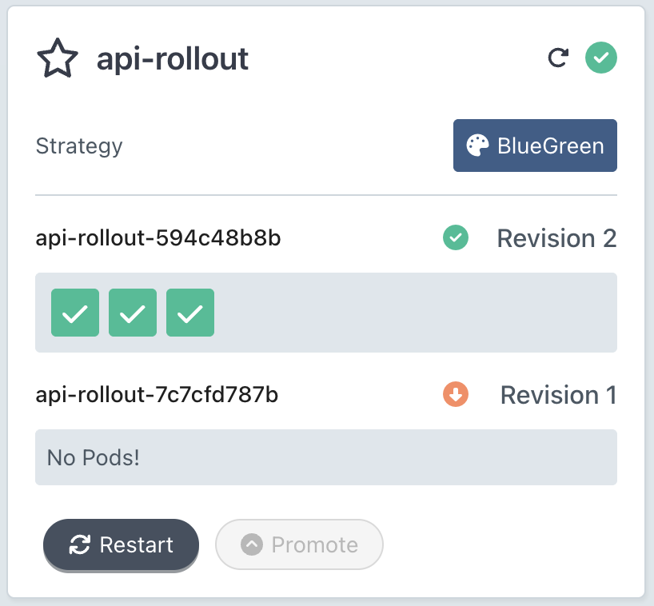

Here's how to set up a production-like approach using NGINX Ingress

### A production-like setup where:
- ✅ Services are accessed via stable domain names
- ✅ No connection disruption during promotion
- ✅ Active and preview versions are always accessible
- ✅ Mimics how it works with real load balancers in production



```bash
kubectl apply -f blue-green-rollout.yaml

kubectl apply -f api-ingress.yaml

kubectl get ingress
# NAME          CLASS   HOSTS                         ADDRESS     PORTS   AGE
# api-ingress   nginx   api.local,preview.api.local   localhost   80      10s

kubectl get endpoints api-service-active api-service-preview
# NAME                  ENDPOINTS                                      AGE
# api-service-active    10.1.0.53:8080,10.1.0.54:8080,10.1.0.55:8080   25s
# api-service-preview   10.1.0.53:8080,10.1.0.54:8080,10.1.0.55:8080   25s

curl http://api.local # response="Blue Version v1.0"
curl http://preview.api.local # same response="Blue Version v1.0"
```



---

```bash
# Deploy new version
kubectl apply -f blue-green-rollout-v2.yaml

kubectl get endpoints api-service-active api-service-preview
# NAME                  ENDPOINTS                                      AGE
# api-service-active    10.1.0.53:8080,10.1.0.54:8080,10.1.0.55:8080   86s
# api-service-preview   10.1.0.56:8080,10.1.0.57:8080,10.1.0.58:8080   86s

curl http://api.local # response="Blue Version v1.0"
curl http://preview.api.local # New version response="Green Version v2.0"
```


---

```bash
# Promote when ready
kubectl argo rollouts promote api-rollout

curl http://api.local # New version response="Green Version v2.0"
curl http://preview.api.local # response="Green Version v2.0"

kubectl get endpoints api-service-active api-service-preview
# NAME                  ENDPOINTS                                      AGE
# api-service-active    10.1.0.56:8080,10.1.0.57:8080,10.1.0.58:8080   2m40s
# api-service-preview   10.1.0.56:8080,10.1.0.57:8080,10.1.0.58:8080   2m40s
```





