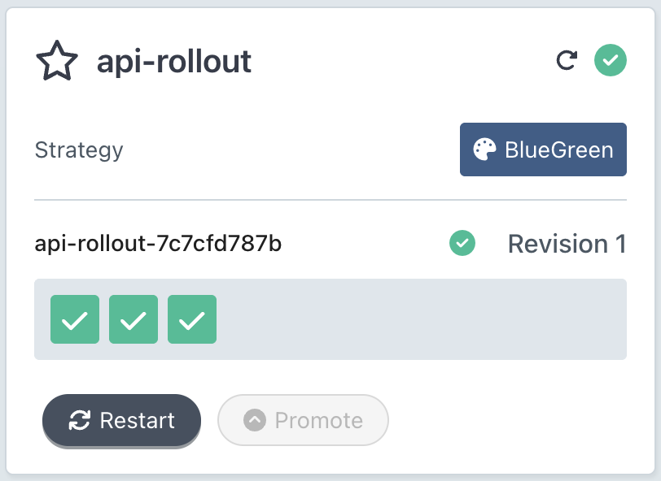
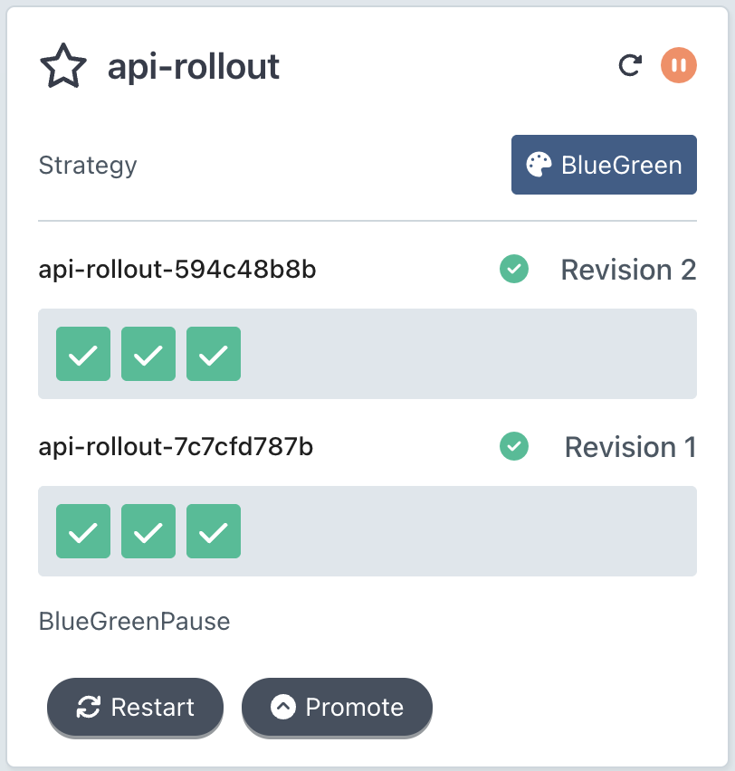
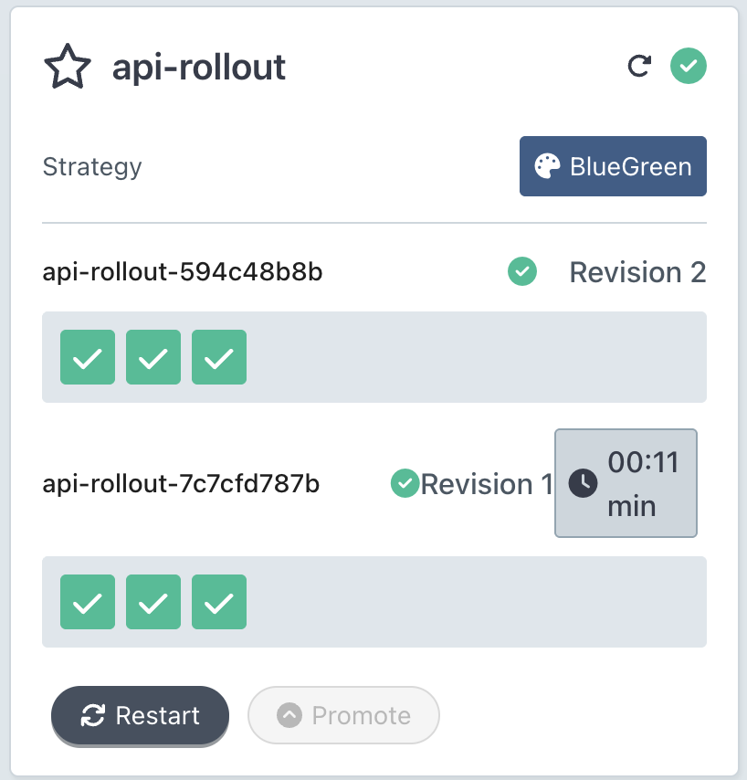
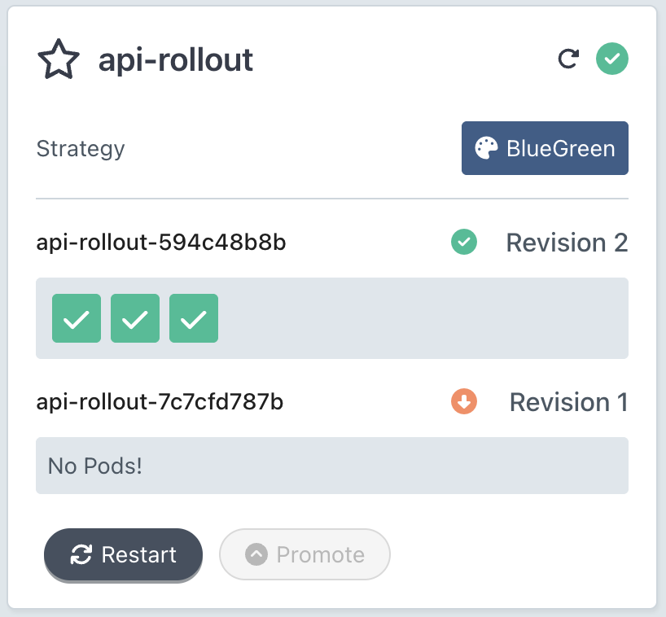

# 🔵🟢 Blue-Green Deployment with NGINX Ingress

> **Production-ready zero-downtime deployments!** Experience instant traffic switching with stable domain names and real load balancer behavior.

## 🎯 What Makes This Production-Ready?

- 🌐 **Stable Domain Names** - Services accessed via consistent URLs
- 🔄 **Zero Connection Disruption** - Seamless promotion without dropping connections
- 👀 **Always Accessible Versions** - Both active and preview environments available
- 🚀 **Real Load Balancer Behavior** - Mimics production infrastructure perfectly

## 📊 Architecture Overview


## 🚀 Step 1: Initial Deployment

### 📝 Setup Your Local Environment
```bash
# 🔧 Update Your Hosts File for local testing
sudo nano /etc/hosts
# Add these lines, then save and exit:
# 127.0.0.1 api.local
# 127.0.0.1 preview.api.local
```

### 🎯 Deploy the Application
```bash
# 📦 Deploy the rollout configuration
kubectl apply -f blue-green-rollout.yaml

# 🌐 Set up ingress routing
kubectl apply -f api-ingress.yaml
```

### ✅ Verify Deployment
```bash
# 🔍 Check ingress status
kubectl get ingress
# Expected output:
# NAME          CLASS   HOSTS                         ADDRESS     PORTS   AGE
# api-ingress   nginx   api.local,preview.api.local   localhost   80      10s

# 🎯 Verify service endpoints
kubectl get endpoints api-service-active api-service-preview
# Expected output:
# NAME                  ENDPOINTS                                      AGE
# api-service-active    10.1.0.53:8080,10.1.0.54:8080,10.1.0.55:8080   25s
# api-service-preview   10.1.0.53:8080,10.1.0.54:8080,10.1.0.55:8080   25s

# 🧪 Test the endpoints
curl http://api.local          # Should return: "Blue Version v1.0"
curl http://preview.api.local  # Should return: "Blue Version v1.0"
```

> 💡 **Note**: Initially, both active and preview services point to the same pods.

### 📸 Initial State


---

## 🎯 Step 2: Deploy New Version

### 🚢 Rolling Out the Green Version
```bash
# 🆕 Deploy the new version (Green v2.0)
kubectl apply -f blue-green-rollout-v2.yaml
```

### 🔍 Monitor the Deployment
```bash
# 👀 Check how endpoints have changed
kubectl get endpoints api-service-active api-service-preview
# Notice the different endpoints:
# NAME                  ENDPOINTS                                      AGE
# api-service-active    10.1.0.53:8080,10.1.0.54:8080,10.1.0.55:8080   86s  ← Still Blue
# api-service-preview   10.1.0.56:8080,10.1.0.57:8080,10.1.0.58:8080   86s  ← New Green!

# 🧪 Test both versions side by side
curl http://api.local          # Still returns: "Blue Version v1.0" (production)
curl http://preview.api.local  # Now returns: "Green Version v2.0" (preview)
```

> 🎉 **Magic Moment**: You now have both versions running simultaneously! Production traffic stays on Blue while you can test Green on the preview URL.

### 📸 Green Version in Preview


---

## 🎯 Step 3: The Promotion Decision

### 🚀 Go Live with Green Version
Once you've tested the preview and everything looks good:

```bash
# 🎉 Promote the Green version to production
kubectl argo rollouts promote api-rollout
```

### ⚡ Instant Traffic Switch
```bash
# 🧪 Verify the promotion worked
curl http://api.local          # Now returns: "Green Version v2.0" ✨
curl http://preview.api.local  # Still returns: "Green Version v2.0"

# 🔍 Check that both services now point to Green pods
kubectl get endpoints api-service-active api-service-preview
# Both services now use the same Green endpoints:
# NAME                  ENDPOINTS                                      AGE
# api-service-active    10.1.0.56:8080,10.1.0.57:8080,10.1.0.58:8080   2m40s ← Now Green!
# api-service-preview   10.1.0.56:8080,10.1.0.57:8080,10.1.0.58:8080   2m40s ← Still Green
```

### 📸 Promotion Process
<div style="display: flex; gap: 20px;">


</div>

It successfully performed a **zero-downtime Blue-Green deployment**! 

✅ **What just happened:**
- Old Blue version (v1.0) was replaced by Green version (v2.0)
- No users experienced any downtime or connection drops
- Traffic switched instantly from Blue to Green
- Blue pods will be automatically cleaned up after the configured delay

## 🛠️ Useful Commands

```bash
# 📊 Watch rollout status in real-time
kubectl argo rollouts get rollout api-rollout --watch

# 📈 Open the Argo Rollouts dashboard
kubectl argo rollouts dashboard

# 🔄 Rollback if something goes wrong
kubectl argo rollouts abort api-rollout
kubectl argo rollouts undo api-rollout

# 📜 View rollout history
kubectl argo rollouts history api-rollout
```

## 🎯 Key Takeaways

- 🔵 **Blue-Green** = Instant switching between two complete environments
- 🌐 **Production URLs** never change, ensuring no client-side updates needed
- 👀 **Preview testing** allows validation before promotion
- ⚡ **Zero downtime** guaranteed during deployments
- 🔄 **Easy rollbacks** if issues are discovered post-deployment

