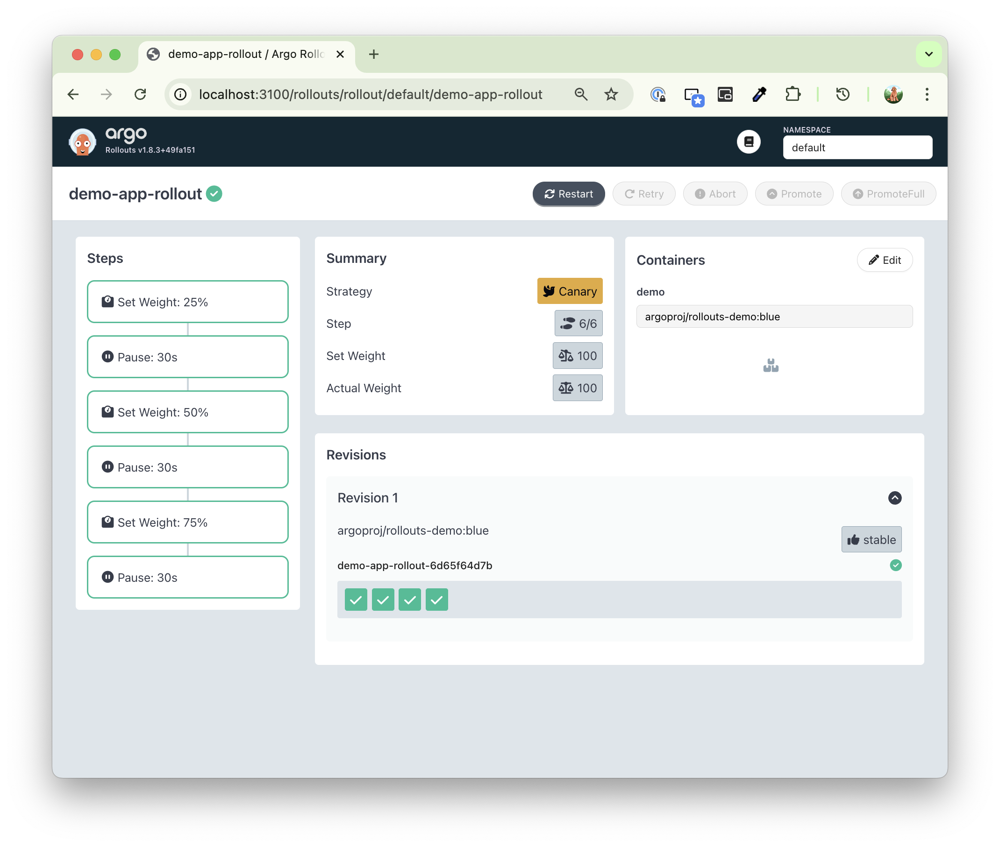
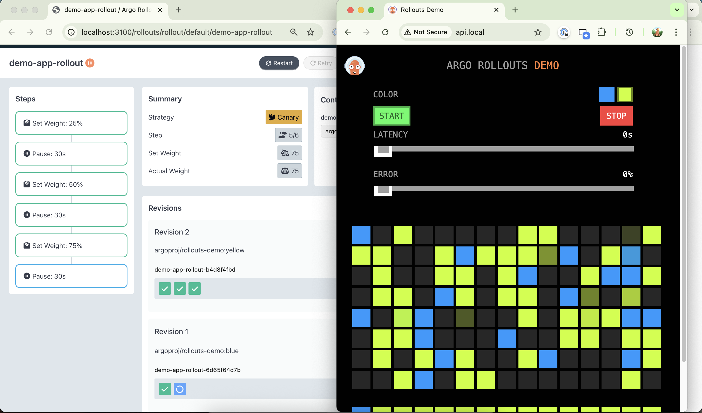

Steps to deploy a canary release with Argo Rollouts on your Mac with Docker Desktop Kubernetes:

## 1. Install Argo Rollouts Controller
```bash
kubectl create namespace argo-rollouts
kubectl apply -n argo-rollouts -f https://github.com/argoproj/argo-rollouts/releases/latest/download/install.yaml
# Verify it's running:
kubectl get pods -n argo-rollouts
```

## 2. Install Argo Rollouts kubectl Plugin
```bash
brew install argoproj/tap/kubectl-argo-rollouts
# Or download directly:
curl -LO https://github.com/argoproj/argo-rollouts/releases/latest/download/kubectl-argo-rollouts-darwin-amd64
chmod +x kubectl-argo-rollouts-darwin-amd64
sudo mv kubectl-argo-rollouts-darwin-amd64 /usr/local/bin/kubectl-argo-rollouts
```

## 3. Install NGINX Ingress Controller
```bash
# Install NGINX Ingress Controller
kubectl apply -f https://raw.githubusercontent.com/kubernetes/ingress-nginx/controller-v1.9.4/deploy/static/provider/cloud/deploy.yaml

# Wait for it to be ready
kubectl wait --namespace ingress-nginx \
  --for=condition=ready pod \
  --selector=app.kubernetes.io/component=controller \
  --timeout=120s

# Update Your Hosts File
# Edit hosts file
sudo nano /etc/hosts
## Add these lines then Save and exit:
# 127.0.0.1 api.local
```

## 4. Create a Sample Canary Rollout
- Create a file canary-rollout.yaml
- Create a Service (service.yaml)
- Create an ingress (api-ingress.yaml)

## 5. Deploy
```bash
kubectl apply -f canary-rollout.yaml
kubectl apply -f service.yaml
kubectl apply -f api-ingress.yaml
```

## 6. Watch the Rollout
```bash
kubectl argo rollouts get rollout demo-app-rollout --watch
# Or use the dashboard:
kubectl argo rollouts dashboard
open http://localhost:3100

open http://api.local
```





## 7. Trigger a Canary Update
Update the image to trigger a canary deployment:
```bash
kubectl argo rollouts set image demo-app-rollout demo=argoproj/rollouts-demo:yellow
# Watch it gradually shift traffic through the canary stages (25% → 50% → 75% → 100%).
```

### Example Dashboard of Canary Deployment (old-Blue to new-Yellow):
*Revision 1 --> Revision 2

https://github.com/user-attachments/assets/6865c143-853b-42aa-9759-49b7af0a98c1





## Optional Abort and Rollback:
```bash
# abort in-process canary deployment
kubectl argo rollouts abort demo-app
# rollback the completed deployment to the previous revision
kubectl argo rollouts undo demo-app
```
### Example Dashboard of Rollback (new-Yellow to old-Blue):
*Revision 2 --> Revision 3


