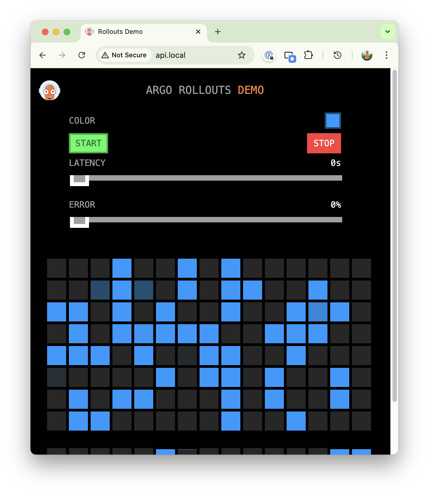

# 🐦 Canary Deployment with Progressive Traffic Splitting

> **Gradual rollouts with confidence!** Deploy new versions progressively while monitoring real user traffic at each step.

## 🎯 What is Canary Deployment?

Canary deployment gradually shifts traffic from the old version to the new version:
- 📊 **25% → 50% → 75% → 100%** traffic progression
- 🔍 **Real user feedback** at each stage
- 🛑 **Stop anytime** if issues are detected
- 📈 **Risk mitigation** through incremental rollout

---

## 🚀 Prerequisites Setup

### 1️⃣ Install Argo Rollouts Controller
```bash
# 📦 Create namespace and install controller
kubectl create namespace argo-rollouts
kubectl apply -n argo-rollouts -f https://github.com/argoproj/argo-rollouts/releases/latest/download/install.yaml

# ✅ Verify installation
kubectl get pods -n argo-rollouts
# Wait for pods to be Running
```

### 2️⃣ Install Argo Rollouts kubectl Plugin
```bash
# 🍺 Easy installation with Homebrew
brew install argoproj/tap/kubectl-argo-rollouts

# 🔄 Alternative: Manual installation
# curl -LO https://github.com/argoproj/argo-rollouts/releases/latest/download/kubectl-argo-rollouts-darwin-amd64
# chmod +x kubectl-argo-rollouts-darwin-amd64
# sudo mv kubectl-argo-rollouts-darwin-amd64 /usr/local/bin/kubectl-argo-rollouts

# ✅ Verify plugin installation
kubectl argo rollouts version
```

### 3️⃣ Install NGINX Ingress Controller
```bash
# 🌐 Install NGINX Ingress Controller
kubectl apply -f https://raw.githubusercontent.com/kubernetes/ingress-nginx/controller-v1.9.4/deploy/static/provider/cloud/deploy.yaml

# ⏳ Wait for controller to be ready
kubectl wait --namespace ingress-nginx \
  --for=condition=ready pod \
  --selector=app.kubernetes.io/component=controller \
  --timeout=120s
```

### 4️⃣ Setup Local DNS
```bash
# 🔧 Update your hosts file for local testing
sudo nano /etc/hosts
# Add this line, then save and exit:
# 127.0.0.1 api.local
```

---

## 📦 Deployment Process

### Step 1: Deploy Initial Configuration
```bash
# 🚀 Deploy all components at once
kubectl apply -f canary-rollout.yaml
kubectl apply -f service.yaml
kubectl apply -f api-ingress.yaml
```

> 💡 **Pro Tip**: The configuration files include everything needed for canary deployment!

### Step 2: Monitor Initial Deployment
```bash
# 📊 Watch rollout progress in real-time
kubectl argo rollouts get rollout demo-app-rollout --watch

# 📈 Or use the beautiful dashboard
kubectl argo rollouts dashboard
open http://localhost:3100

# 🌐 Test your application
open http://api.local
```

### 📸 Initial State Screenshots
<div style="display: flex; gap: 15px; flex-wrap: wrap;">


</div>



> 🎯 **Initial State**: Your application is now running with the original (blue) version.


---

## 🎯 The Canary Magic: Progressive Rollout

### Step 3: Trigger a New Version Deployment
```bash
# 🆕 Deploy the new yellow version
kubectl argo rollouts set image demo-app-rollout demo=argoproj/rollouts-demo:yellow

# 👀 Watch the magic happen - traffic gradually shifts:
# 25% → 50% → 75% → 100%
kubectl argo rollouts get rollout demo-app-rollout --watch
```

### 🎬 Watch the Progressive Rollout in Action
**Canary Deployment Journey: Blue → Yellow (Revision 1 → Revision 2)**

https://github.com/user-attachments/assets/6865c143-853b-42aa-9759-49b7af0a98c1

### 📊 Traffic Progression Screenshots

#### 🟢 Stage 1: 25% Canary Traffic

> 25% of your users are now testing the new version while 75% stay on the stable blue version.

#### 🟡 Stage 3: 75% Canary Traffic  

> Majority of users (75%) are now on the new version. Looking good? Time for full rollout!

#### 🎉 Stage 4: 100% Complete

> 🎊 **Success!** All users are now on the new yellow version. Canary deployment complete!

---

## 🚨 When Things Go Wrong: Abort & Rollback

### 🛑 Emergency Brake: Abort Canary
If you notice issues during the canary deployment:
```bash
# 🚨 Immediately stop the canary and revert to stable version
kubectl argo rollouts abort demo-app-rollout
```

### 🔄 Rollback After Completion
If problems are discovered after a successful deployment:
```bash
# ⏪ Rollback to the previous stable revision
kubectl argo rollouts undo demo-app-rollout
```

### 📸 Rollback Process in Action
**Emergency Rollback: Yellow → Blue (Revision 2 → Revision 3)**

#### 🟡 Rollback Stage: 50% Back to Stable

> Half the users are back on the stable blue version while rollback continues.

#### ✅ Rollback Complete: 100% Stable

> 🎯 **Crisis Averted!** All users are back on the proven stable version.

---

## 🛠️ Essential Commands Cheat Sheet

```bash
# 📊 Real-time rollout monitoring
kubectl argo rollouts get rollout demo-app-rollout --watch

# 🎯 Manual promotion to next stage
kubectl argo rollouts promote demo-app-rollout

# 🚨 Emergency abort (stop and revert)
kubectl argo rollouts abort demo-app-rollout

# ⏪ Rollback to previous version
kubectl argo rollouts undo demo-app-rollout

# 📈 Open beautiful dashboard
kubectl argo rollouts dashboard

# 📜 View deployment history
kubectl argo rollouts history demo-app-rollout

# 🔍 Check current status
kubectl argo rollouts status demo-app-rollout
```

## 🎓 Key Learnings

### ✅ **Canary Benefits**
- 🔍 **Risk Mitigation** - Test with real users gradually
- 📊 **Data-Driven Decisions** - Monitor metrics at each stage  
- 🛑 **Easy Rollback** - Stop anytime if issues detected
- 👥 **User Experience** - Minimal impact if problems occur

### 🎯 **When to Use Canary**
- 🆕 **Major feature releases** 
- 🔄 **Critical system updates**
- 🧪 **A/B testing scenarios**
- 📈 **Performance optimizations**

### 🚀 **Production Tips**
- 📊 Set up monitoring and alerting
- 🕐 Configure appropriate stage durations
- 🎯 Define success criteria for each stage
- 📱 Test rollback procedures regularly

---
