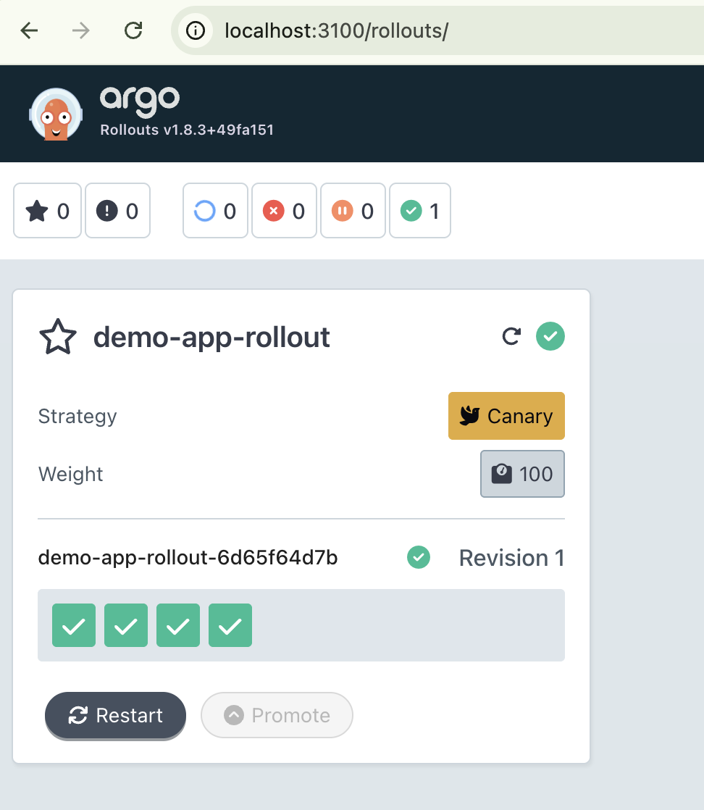

Steps to deploy a canary release with Argo Rollouts on your Mac with Docker Desktop Kubernetes:

## 1. Install Argo Rollouts Controller
```bash
kubectl create namespace argo-rollouts
kubectl apply -n argo-rollouts -f https://github.com/argoproj/argo-rollouts/releases/latest/download/install.yaml
Verify it's running:
kubectl get pods -n argo-rollouts
```

## 2. Install Argo Rollouts kubectl Plugin
```bash
brew install argoproj/tap/kubectl-argo-rollouts
Or download directly:
bashcurl -LO https://github.com/argoproj/argo-rollouts/releases/latest/download/kubectl-argo-rollouts-darwin-amd64
chmod +x kubectl-argo-rollouts-darwin-amd64
sudo mv kubectl-argo-rollouts-darwin-amd64 /usr/local/bin/kubectl-argo-rollouts
```

## 3. Create a Sample Canary Rollout
- Create a file rollout.yaml
- Create a Service

## 4. Deploy
```bash
kubectl apply -f canary-rollout.yaml
kubectl apply -f service.yaml
```

## 5. Watch the Rollout
```bash
kubectl argo rollouts get rollout demo-app --watch
# Or use the dashboard:
kubectl argo rollouts dashboard
open http://localhost:3100
```




## 6. Trigger a Canary Update
Update the image to trigger a canary deployment:
```bash
kubectl argo rollouts set image demo-app demo=argoproj/rollouts-demo:yellow
# Watch it gradually shift traffic through the canary stages (25% → 50% → 75% → 100%).
```


